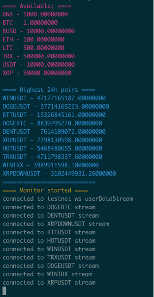

# Setup

``` git clone https://github.com/aplb/b-test-task.git btt && cd btt```

``` npm install ```

``` cp ./src/config.example.js ./src/config.js ```

Put apiKey and secretKey into config.js.

``` npm start ```

# Libraries

ws and request-promise used.

# Tests
``` npm test ```

# Misc
Ran against node v14. Expected look.



